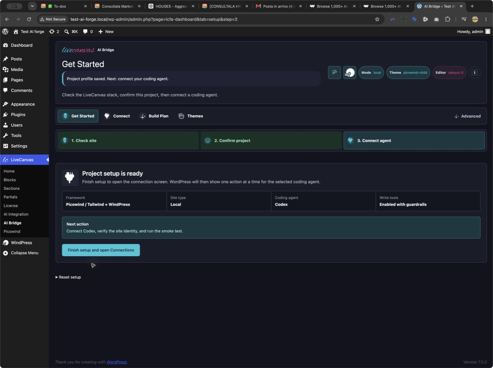
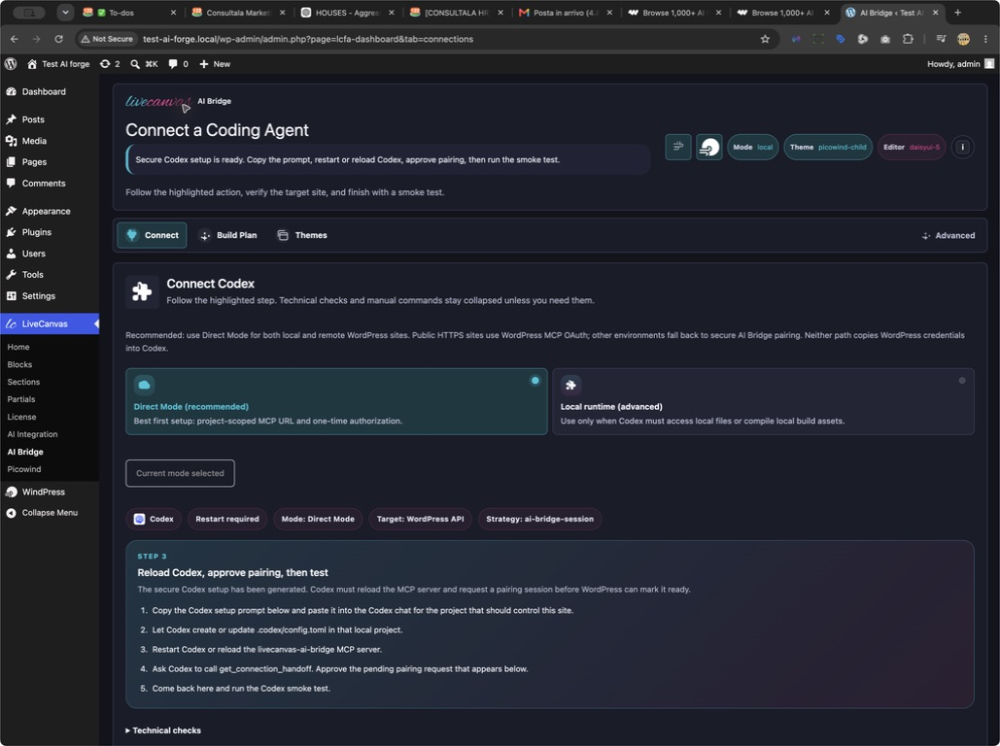
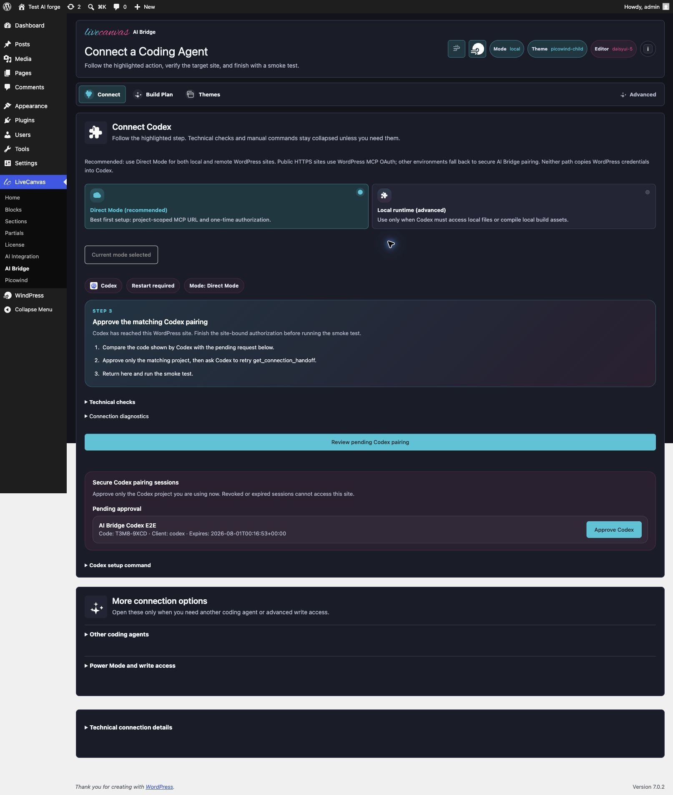
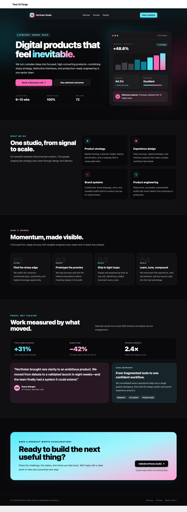
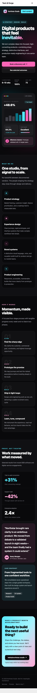
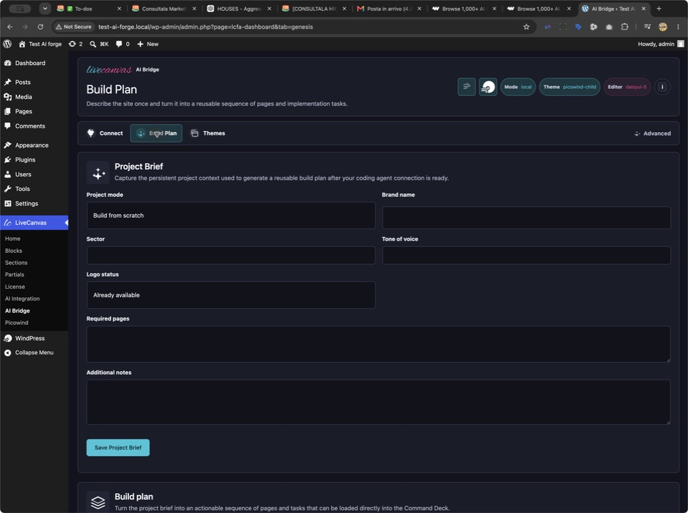
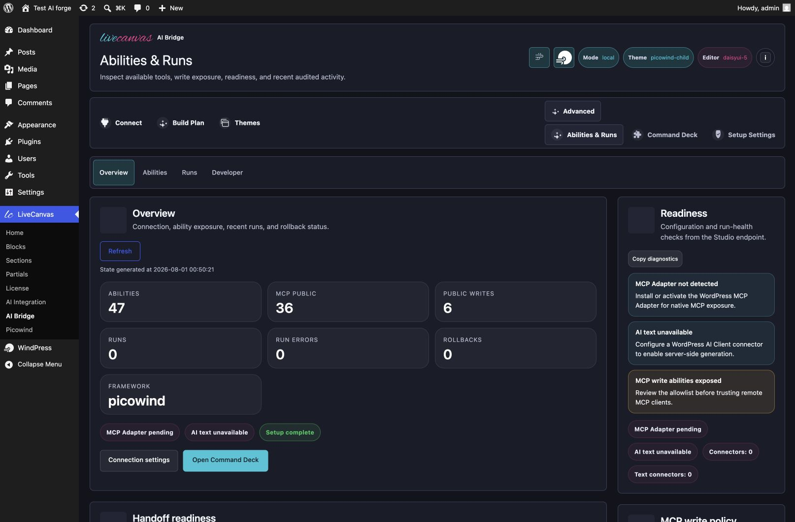
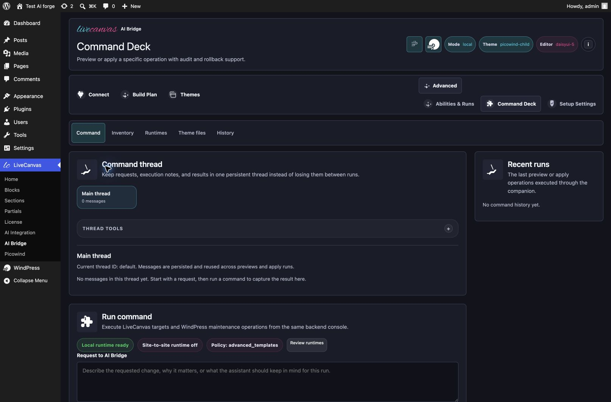
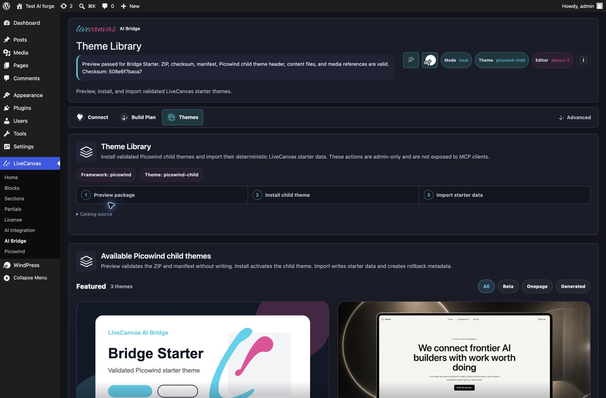

# Connect Codex or OpenCode to LiveCanvas AI Bridge

LiveCanvas AI Bridge connects a project-scoped coding agent to one WordPress site. The agent can inspect the LiveCanvas structure, preview changes, and use explicitly enabled write abilities without receiving a WordPress password.

This guide uses a clean local WordPress installation with LiveCanvas, Picowind, and WindPress.

## Before you start

You need:

- WordPress with LiveCanvas installed and licensed;
- LiveCanvas AI Bridge installed and activated;
- one Codex or OpenCode project dedicated to this WordPress site;
- Node.js only when the site uses the secure local pairing fallback.

Keep one project connected to one site. AI Bridge verifies the WordPress URL and Site ID before allowing writes.

## 1. Complete the WordPress setup

Open `LiveCanvas > AI Bridge`. Choose the site framework, confirm where WordPress runs, and select the coding agent.

When setup is complete, open **Connect**.

## 2. Generate the project configuration

Keep **Direct Mode** selected. It is the recommended path for local and remote sites.

Click **Connect Codex securely**, then copy **Prompt for Codex** into the Codex project that belongs to this WordPress site. Codex updates only that project's `.codex/config.toml` file.

The project must be trusted before Codex will load project-scoped MCP configuration. Restart Codex after the configuration is written. The first MCP startup can take up to 60 seconds.

For OpenCode, open **Other coding agents**, choose OpenCode, and place the generated `opencode.json` in the project root. AI Bridge configures a 60-second first-start timeout.

## 3. Approve the matching project

Ask the agent to call `get_connection_handoff` with `{"limit":5}` and make no changes.

On local or private sites, the agent returns a temporary pairing code. Return to WordPress and approve only the project whose code matches the agent response.

AI Bridge now replaces the technical setup prompt with the one action that matters: review and approve the matching pairing.

The resulting session is:

- scoped to LiveCanvas AI Bridge;
- bound to the current site fingerprint;
- time-limited and revocable;
- stored hashed in WordPress;
- not a WordPress account credential.

## 4. Verify the connection

Ask the agent to retry `get_connection_handoff`, then run the smoke test in WordPress.

The connection is complete only when **Connections** shows `Ready`. Before the first write, verify:

- the reported site URL;
- the Site ID fingerprint;
- the active framework;
- the granted scopes;
- the read-only-first guardrail.

Start with a preview or dry run. Apply a change only after reviewing the target and diff.

## Verified end-to-end result

The same clean test site was paired with Codex and OpenCode using two separate, site-bound sessions. Both agents reported the exact WordPress URL, Site ID, Picowind framework, and granted scopes before any write.

Codex then created one draft LiveCanvas page: **Northstar Studio - Codex E2E** (`page_id=11`). The create operation returned audit ID `audit-ehbrtb8p6ki6` with rollback available.

OpenCode read that page, previewed one exact text match, and changed only the final CTA to **Ready to build the next useful thing?**. The apply operation returned audit ID `audit-zzzdvomr1xpi` with rollback available.

The mobile visual check reported no horizontal overflow at 390 px.

## Build a site from scratch

Use **Build Plan** to store the brand, sector, tone, required pages, and implementation notes. The plan becomes persistent context for the connected coding agent.

Example prompt:

> Create a one-page website for a small architecture studio. First inspect the theme and LiveCanvas context. Propose a page structure and design system, then preview the homepage without writing anything. After I approve the preview, create a draft LiveCanvas page and keep header and footer as separate partials.

## Review abilities and operations

After the connection is ready, use **Abilities & Runs** to inspect readiness, exposed abilities, recent operations, and rollback status. The default Overview stays compact; detailed ability tables, run history, and developer contracts have separate views.

Use **Command Deck** only for a specific manual operation. Its workspaces separate the command form, LiveCanvas inventory, build runtimes, theme files, and history so advanced controls do not compete with the current task.

## Optional starter themes

The Theme Library can install a validated Picowind child theme and import its homepage, partials, media, design system, and menu data. Its controls unlock in order: validate the package, install the child theme, then import starter data.

## Troubleshooting

### The agent cannot see AI Bridge

Confirm that the generated project config is in the project you currently opened. Restart the agent and allow up to 60 seconds for the first MCP startup.

### Codex ignores `.codex/config.toml`

Trust the Codex project, close Codex completely, and reopen the same project.

### Pairing keeps returning pending

Approve the exact temporary code in WordPress, then ask the same agent process to retry the handoff before the request expires.

### Reads work but writes do not

Check the session scopes and the AI Bridge write allowlist. Preview abilities remain available even when public apply abilities are disabled.

### The wrong site appears

Stop immediately. Regenerate the setup from the intended WordPress installation and replace only that site's MCP block in the project config.

## Verification record

- WordPress: `7.0.2`
- OpenCode: `1.18.10`
- Codex MCP startup: verified
- OpenCode MCP discovery: verified
- Site-bound pairing request: verified
- Codex approved handoff and draft page creation: verified
- OpenCode approved handoff and targeted content patch: verified
- Session scopes: `read`, `preview`, `write`, `media`, `theme_files`, `debug`, `cache`, `seo`
- Desktop visual check: 1440 x 1000, no horizontal overflow
- Mobile visual check: 390 x 844, no horizontal overflow
- Existing baseline pages modified: none
